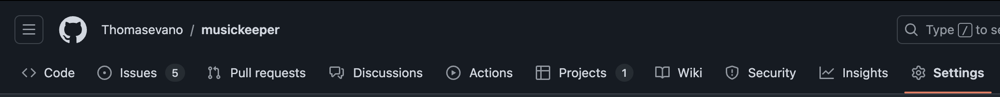
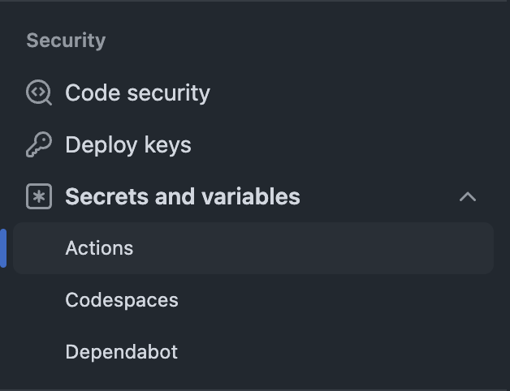
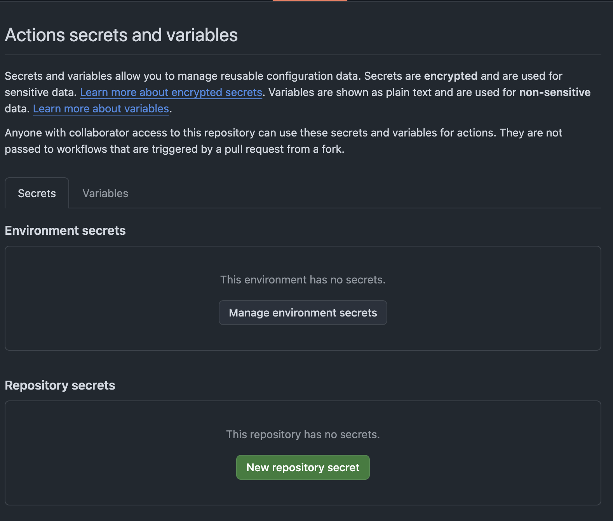

I host my projects on a [Coolify](https://coolify.io) instance. it's an amazing product, it works really well, I've been looking for a while to find a self-hosted PaaS to deploy my projects on an instance that I own. The only problem for now is that when using [Cloud version](https://coolify.io/cloud) (Coolify instance managed by them), I noticed a rather long build time even more so when using a Docker image. To reduce build time, I came up with a solution that I knew would be faster, Github actions.

## Where to store variables on Github ?

My Docker image needs environnment variables to work. I need to set them somewhere in Github. For this I need to go to the settings of my repository.


Then in the "Security" tab > "Secrets and Variables" > "actions"


When you arrive on this page, there is 4 places divided in 2 tabs where you can set your variables. First in the "Secrets" tab in the "Environment secrets" section, then in the "Variables" tab which is at the same place.


The first lines tells us the best way to set the variables depending our needs. In my case, as it's confidentials variables, the **Secrets** tab is the most appropriate.


Once all my variables are set in the 'repository secrets' section, it's time to use them in my github action.

## How to use them in a Github action

There is multiple ways to use variables inside a github action. As a good developer, I started to follow [Github documenatation](https://docs.github.com/en/actions/security-for-github-actions/security-guides/using-secrets-in-github-actions#using-secrets-in-a-workflow), thinking naïvely that it would work the first time (spoiler: it's rare in development).

My mistake was to not immediately think that I wanted to use them inside a Dockerfile. One little research later, taking this into consideration, here i am reading [Docker documentation](https://docs.docker.com/build/ci/github-actions/secrets/) then much more suited to my specific case. So I took care of reproducing this in my Github action, and there is the code:

```yaml
- name: Build image and push to registry
        uses: docker/build-push-action@v6.7.0
        with:
          context: .
          file: Dockerfile
          secrets: |
            "your_secret=${{ secrets.YOUR_SECRET }}"
          platforms: linux/amd64
          push: true
          tags: ${{ env.REGISTRY }}/${{ env.IMAGE_NAME }}:latest
```

## Using the variable in the Dockerfile

Inside Docker documentation, it is indicated that the secret must be used as such:

```dockerfile
RUN --mount=type=secret,id=github_token,env=YOUR_SECRET
```

In my case, this didn't work. It's the step that caused me the most trouble, during a moment, I was unable to have this value in my Dockerfile. Fortunately, a member of the Coolify Discord community helped me and appeared with this solution:

```dockerfile
RUN  --mount=type=secret,id=your_secret \
  echo "YOUR_SECRET=$(cat /run/secrets/your_secret)" >> .env.production
```

I will be honest, I still don't know how this magic works, but it works. If you understand it, any help is welcome to help me understand how it works.

### ⚠️ The variables must be placed at build time in your Dockerfile, just before the command

```bash
npm run build
```

## Conclusion

I hope this article will help other peoples who have encountered this problem.

This is my first article, and I hope to write many more on subjects that I'm passionate about our other problems I have encountered and that I succeed in solving like this one.

I will soon introduce you to the application for which I encountered this problem. Don't forget to subscribe to the RSS feed so you don't miss a thing, and follow me on Twitter [@tvn_dev](https://twitter.com/tvn_dev) and Bluesky [@tvn.dev](https://bsky.app/profile/tvn.dev).
