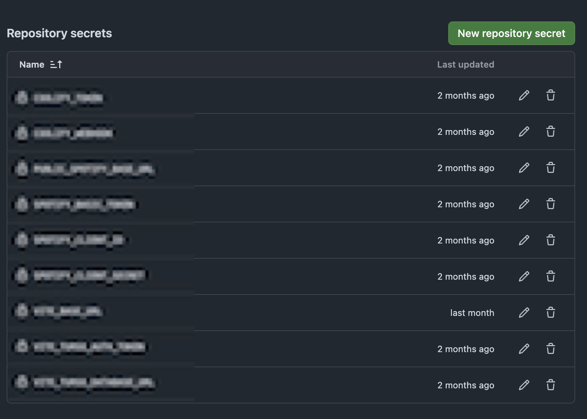

J'héberge mes projets sur une instance [Coolify](https://coolify.io). C'est génial, ça marche très bien, ca faisait un moment que je cherchais un PaaS que je pouvais héberger moi même. Le seul problème c'est qu'en utilisant la version Cloud (instance gérer par Coolify), le temps de build d'une application est plutôt long et d'autant plus lorsqu'il s'agit d'une image Docker.
Afin de réduire ce temps de build, je me suis tourné vers les github actions.

## Ou mettre les variables dans Github ?

Mon image Docker nécessite des variables d'environnement pour fonctionner. Il faut alors les mettre quelque part sur Github. Pour cela il suffit de se rendre dans les paramètres du repository


Puis dans l'onglet "Security" > "Secrets and Variables" > "actions"


Lorsque l'on se retrouve alors sur cette page on se retrouve un peu perdu, personnellement. Il y a alors 4 emplacements divsisé en 2 onglets ou entrer ses variables. D'abord dans l'ongle "Secrets" dans la section "Environment secrets" ou "Repository secrets", puis dans l'onglet "Variables" qui est composé des meme emplacements.

<a id="github_repository_secrets"></a>
Commencer par lire les 2 première lignes peut nous indiquer le meilleur emplacement selon notre besoins. Dans mon cas, vu qu'il s'agit de token d'authentification a des services externes je me dis que l'onglet secrets est plus adapté. J'ai également un autre indice qui me pousse a cette réflexion dont je ne vous ai pas encore parlé c'est que je possèdes déja 2 "repository secrets" qui me permete d'automatiquement déployé une nouvelle version de mon application sur coolify. En effet j'ai suivi [la documentation de Coolify](https://coolify.io/docs/knowledge-base/git/github/github-actions) a ce sujet.


Une fois toutes mes variables nécessaires rentrées dans le 'repository secrets', il ne me reste plus qu'a les utiliser dans ma github action

## Comment les utiliser dans la Github action

Le plus facile est fait. Je pensais que le reste le serait tout autant, mais dans ma recherche ca n'a fait qu'empirer mais il existe différentes manière de faire pour transmettre des valeurs a un Dockerfile a travers une github action.

J'ai d'abord suivi [la doc](https://docs.github.com/en/actions/security-for-github-actions/security-guides/using-secrets-in-github-actions#using-secrets-in-a-workflow), comme tout bon développeur, pensant naïvement que cela allait marcher du premier coup (spoiler: c'est rare en développement).
Mon erreur a été de ne pas tout de suite penser au fait que je voulais les transmettre a un Dockerfile. Une petite recherche plus tard prenant ceci en considération me voici dans la [documentation](https://docs.docker.com/build/ci/github-actions/secrets/) de Docker alors bien plus adapté. Je m'applique donc a reproduire cela dans ma Github action:

```yaml
- name: Build image and push to registry
        uses: docker/build-push-action@v6.7.0
        with:
          context: .
          file: Dockerfile
          secrets: |
            "your_secret=${{ secrets.YOUR_SECRET }}"
          platforms: linux/amd64
          push: true
          tags: ${{ env.REGISTRY }}/${{ env.IMAGE_NAME }}:latest
```

<a id="secrets_github_action"></a>

Il faut maintenant utiliser cette variable dans le Dockerfile.

## Utiliser la variable dans le Dockerfile

Dans la documentation de Docker cité précédemment il est indiqué que le secret doit etre utilisé comme ceci:

```Dockerfile
RUN --mount=type=secret,id=github_token,env=YOUR_SECRET
```

Dans mon cas cela n'a pas marché. C'est l'étape qui m'a causé le plus de problème, pendant un moment il m'était impossible d'avoir cette valeur dans mon Dockerfile. Heureusement un membre de la communauté du Discord de Coolify m'a bien aidé et apparu avec cette solution:

```Dockerfile
RUN  --mount=type=secret,id=your_secret \
  echo "YOUR_SECRET=$(cat /run/secrets/your_secret)" >> .env.production
```

<a id="secrets_at_buildtime"></a>

Encore aujourd'hui je ne sais pas comment cette magie opère mais cela marche

### ⚠️ Les variables doivent etre placé au moment du build dans votre Dockerfile, juste avant la commande

```bash
npm run build
```

## Conclusion

J'espère que c'est article permettra d'aider d'autres personnes qui ont rencontré ce même problème. Je vous présente bientôt l'application pour laquelle j'ai rencontré ce problème pensez a vous abonner au fluxRSS pour ne rien louper.
C'est mon premier article et je me suis un peu éparpiller entre le tutoriel et le récit de comment j'ai réussi a faire fonctionner tout cela ensemble et je comprends ceux qui voudraient directement avoir la solution et pas s'embêter avec toute cette lecture.

### TLDR

- [Entrez les variables dans la catégorie secrets du repo Github](#github_repository_secrets)
- [Utiliser les variables dans la Github action](#secrets_github_action)
- [Utiliser les variables dans le Dockerfile lors du build de l'image](#secrets_at_buildtime)
